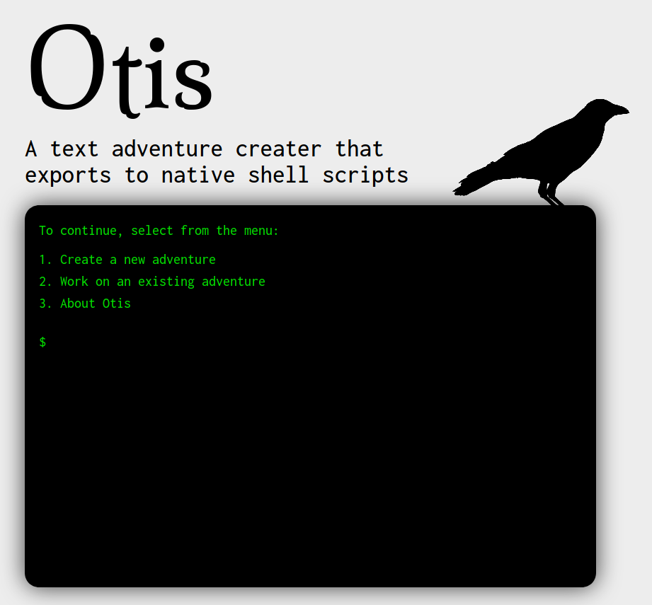

# Otis



Otis will become a text adventure maker that converts to native shell scripts for different operating systems.
It will have it's own markdown language, and is meant to be ran in Docker.

You will be able to export to batch and bash.

Front-end will be React.
Back-end will be Flask.

Database will be MongdoDB.
Testing and building will be with Jenkins.


## Backend structure

### Database Adventures
Each adventure will be stored in the database in the collection "adventures".
This will include:

* title: The title of the adventure.
* source: The source code in Otis markdown.

### API endpoints

* **POST /adventure** Creates a new blank adventure with the title included in the body. Returns the id.
* **GET /adventure** Get an array of all adventures with the title and id.

* **GET /adventure/(id)** Returns the adventure object.
* **PUT /adventure/(id)** Applies any changes included in the request body.
* **DELETE /adventure/(id)** Deletes an adventure.

* **GET /export/(file)/(id)** Returns new file exported from adventure source.


### Otis markdown
Here is an example of an adventure written in Otis markdown:

```
This is the main screen.

* Here is an option {
    Here is a screen inside an option.

    * Another option {

    }
}
* Here is another option {

}
```